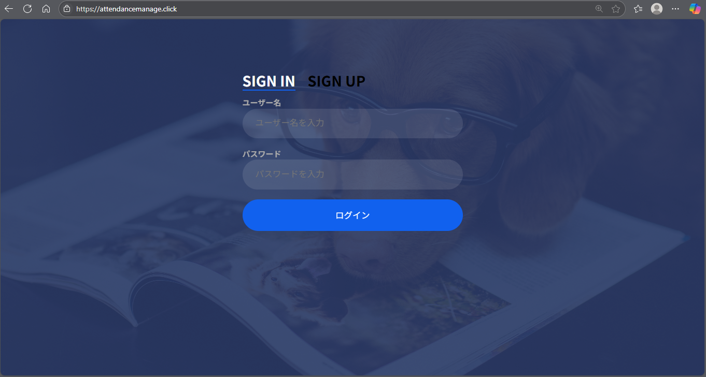
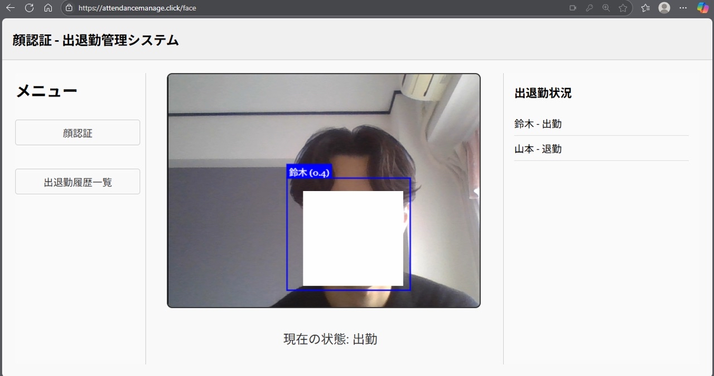
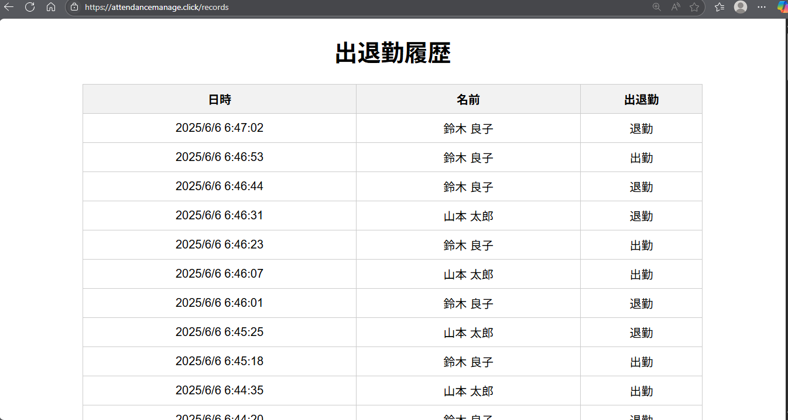

# 顔認証による出退勤管理システム

## はじめに

本システムは、私のアルバイト先での出退勤管理が「紙」で行われていたことに起因しています。  
手書きで出退勤時刻を記録する方式は、**集計に手間がかかり、記入ミスや確認漏れも起こりやすい**と感じていました。  
この課題を解決するために、**顔認証を用いた出退勤管理システム**の開発を個人で行いました。

---

## コンセプト

- **シンプルで誰でも使える出退勤管理**
- **カメラに顔を映すだけで出勤/退勤を自動打刻**
- **ペーパーレス化・業務効率化の促進**
- **スケーラブルな設計で今後の機能拡張にも対応可能**

---

## 概要

- **顔認証**による出退勤の自動打刻  
- **出退勤履歴の一覧表示機能**  
- **ユーザー管理機能（ログイン / セッション管理）**  
- **AWS EC2 + Docker による本番環境構築**  
- **HTTPS 対応（ALB + Route53）**

---

## 環境

- **フロントエンド**: HTML / CSS / JavaScript 
- **バックエンド**: Node.js / Express
- **データベース**: MySQL
- **インフラ**: AWS EC2 (Amazon Linux) + Docker Compose
- **ドメイン管理**: Route53 + ALB + Let's Encrypt (HTTPS化)

---

## 利用方法

1. **ログイン**
    - `/login` からユーザー名・パスワードでログイン
    
2. **顔認証画面**
    - `/face` にて顔認証 → 出勤/退勤自動打刻
    
3. **出退勤履歴閲覧**
    - `/records` にて履歴を確認可能
    - 

---

## 実装予定の機能

- 勤怠データから給与計算の自動化
- 個別の出退勤データの表示
- モバイル対応（スマホでも顔認証可能に）
- 管理者画面の追加（ユーザー管理・勤怠データ編集）

---

## おわりに

業務改善の一環として本システムを開発しましたが、**自分自身のスキル向上や実践的なシステム設計の学習**にもつながりました。  
今後はさらに実用性を高め、多店舗展開や他の事業者でも活用できる汎用的なサービスへの発展も目指しています   
